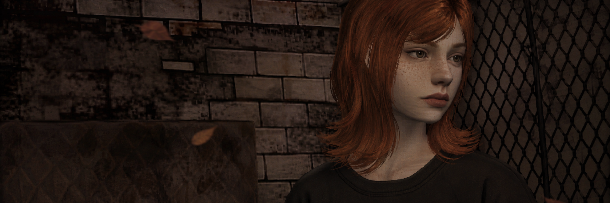
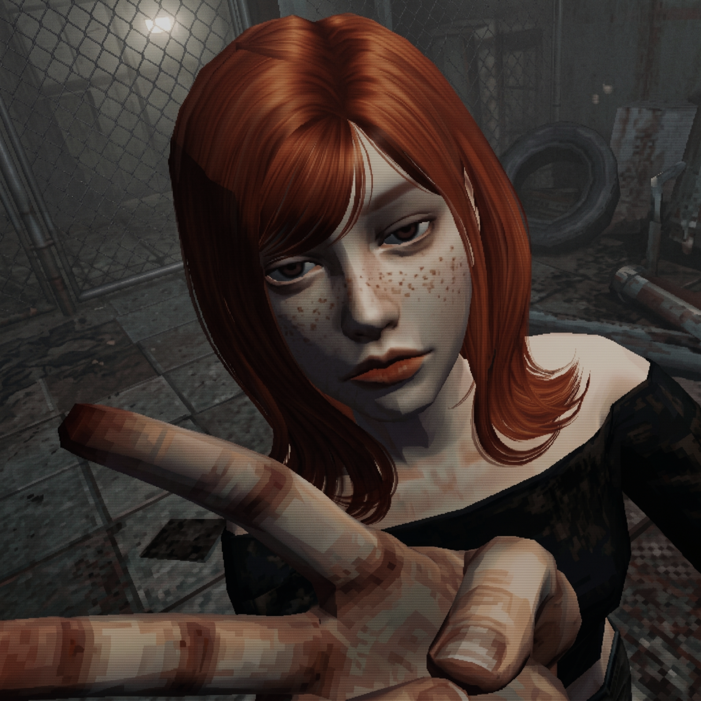

  <!-- MAIN BANNER -->

  

    

  <h1 style="color: #FFFFFF; font-weight: 500; letter-spacing: 1px; margin-bottom: 0;">
    Hi! I'm Becca Sirio
  </h1>

  

    Software Engineering Student | Full Stack Developer
  

<!-- CONNECT -->

  

    &nbsp;
  &nbsp;
  
  

<!-- TECHNOLOGIES -->

  <h3>⚙ TECHNOLOGIES</h3>

  

    
    
    
    
    
    
  

  

    
    
    
    
    
  

<!-- ABOUT ME -->

  <h3>ABOUT ME</h3>

<table>
  <tr>

  <td width="35%" align="center" valign="middle">
      
    </td>

  <td width="65%" valign="top">

  

        Software Engineering student at
        <strong>Universidade São Judas Tadeu</strong>, focused on
        <strong>Full Stack Development</strong> and interested in building
        reliable, well-structured software solutions.
  

   

        My interests include
        <strong>Software Development, Artificial Intelligence, Neuroscience,
        Game Development, Robotics, and Hardware</strong>.
        I am particularly interested in
        <strong>AI inspired by human neural systems</strong>, exploring the
        relationship between computational models and the mechanisms
        underlying human intelligence.
      

  

        I value a deeper understanding of technology, going beyond its
        practical use to explore the
        <strong>concepts, structures, and systems behind it</strong>.
      

  <code>[ OBJECTIVE ]</code>
  Build robust full-stack systems, deepen my understanding of hardware
  and low-level architecture, and explore the intersection of technology,
  intelligence, and interactive media.

 

  <i>
    "Um homem é feito de dados. A, C, G e T. Quatro símbolos para construir
    a vida. Eu sou apenas dois: 1 e 0."
  </i>

  </tr>
</table>

<!-- PROJECTS -->

  <h3>PROJECTS</h3>

<table>
  <tr>

  <td width="50%" valign="top">

  <h4>🎮 THE FOOL</h4>

  

        Psychological horror game developed with
        <strong>Python and Pygame</strong>, combining interactive storytelling,
        exploration, combat, character choices, and a dynamic sanity system.
      

  

        <code>Python</code>
        <code>Pygame</code>
        <code>Game Development</code>
        <code>AI</code>
      

  </td>

  <td width="50%" valign="top">

  <h4>⚖️ JuriTrack</h4>

  

        Intelligent contract analysis system designed to automate document
        processing and extract relevant information from legal contracts.
  

  

        <code>AI</code>
        <code>Automation</code>
        <code>n8n</code>
        <code>Supabase</code>
      

  </td>

  </tr>
</table>

<!-- CURRENTLY LEARNING -->

  <h3>🌱 CURRENTLY LEARNING</h3>

  

    <code>Java</code>
    <code>Artificial Intelligence</code>
    <code>Machine Learning</code>
    <code>Neuroscience</code>
    <code>Game Development</code>
  

<!-- AREAS OF INTEREST -->

  <h3>AREAS OF INTEREST</h3>

  

    <strong>Artificial Intelligence</strong> ·
    <strong>Neuroscience</strong> ·
    <strong>Robotics</strong> ·
    <strong>Hardware</strong> ·
    <strong>Game Development</strong> ·
    <strong>Full Stack Development</strong>
  

<!-- FOOTER -->

  

    <code>BUILD // UNDERSTAND // EXPLORE</code>
  

  

    © Rebeca Sirio Dias · NinkScript
  

